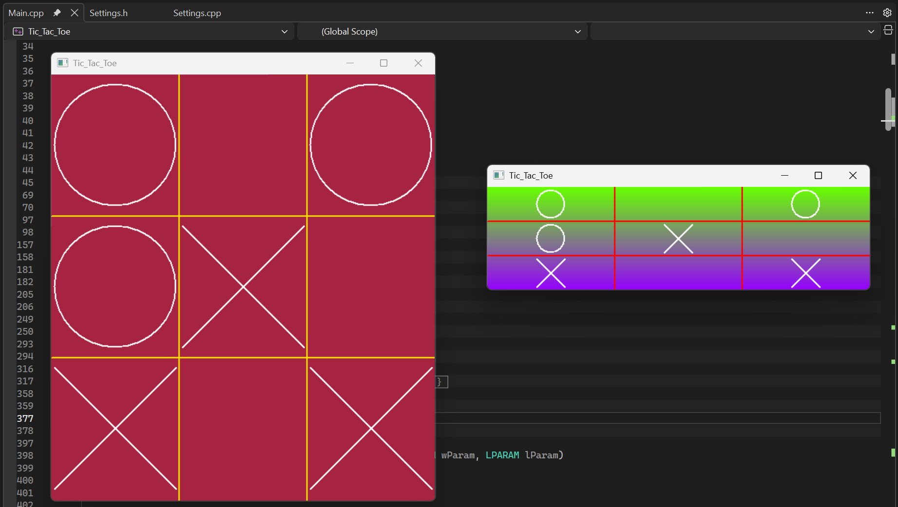

Simple Tic-Tac-Toe game based on WinAPI

You need to open two instances of the application.

There are command line parameters, example:  
**--fieldSize=23** *sets field size to 23x23*  
**--fileMode=1** *chooses first method to work with configuration file, 0 to disable config file, different methods from 1 to 4*

## Keyboard Shortcuts
**Space**: start/stop gradient background
**Enter**: change background color
**Scroll wheel**: smoothly change grid color
**Ctrl + Q**: close app

## Build
Requires dependencies: gdi32, (kernel32), user32, (comctl32).  
You can build by using your build system.
```
mkdir build

cd build

cmake -G "<your build system>" ..

cmake --build . --config Debug --target Tic-Tac-Toe

```

or you can launch .bat file to use Microsoft Visual Studio 2022 build system

## App
